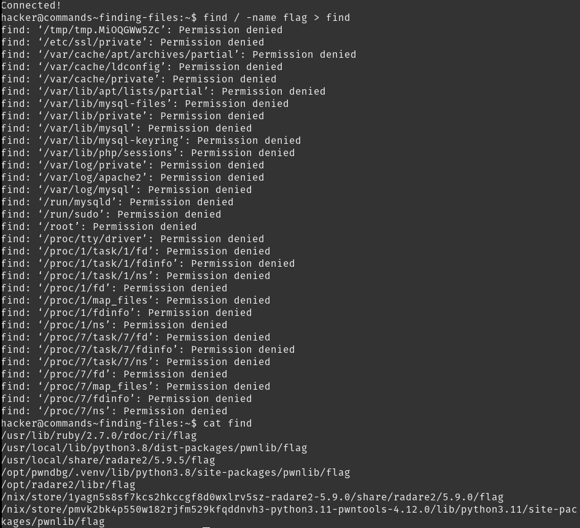

# Finding Files

`find` can be used to find files. `find / -name flag` reveals a bunch of paths. `find / -name flag > ~/find` saves the output of find (excluding the errors) to the file `~/find`. Using `while read -r line; do cat "$line"; done < find` reveals the flag.

## Solution:

