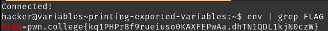

# Printing Exported Variables

`env` prints all the variables, which includes both environment and shell variables. `export` convers a shell varibale to an environment variable. `env | grep FLAG` or `grep FLAG <(env)` both work to get the flag.

## Solution:

