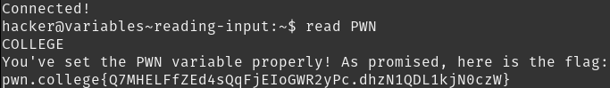

# Reading Input

The `stdin` channel can also be read, using the `read` command. The read command has many useful arguments, such as `-p` for printing a prompt or `-a` to store the input in form of an array.

## Solution:

