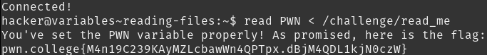

# Reading Files

It makes sense that files can be passed to commands. `read PWN < /challenge/read_me` gives the flag. Interestingly, `/challenge/read_me` contains the data `yYBoQIHHcKJXpKjBinnsk6nJZeWpdSL0AsUh3oYJdvEcrt`.

## Solution:

