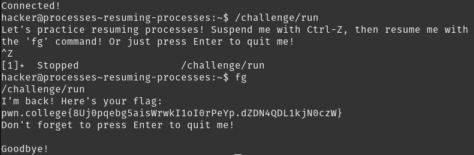

# Resuming Processes

`fg` brings one of the suspended processes to the **f**ore**g**round. Many processes can be suspended, cand the terminal shows how many are suspended when suspending a process.

## Solution:

