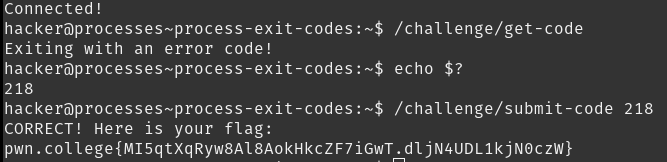

# Process Exit Codes

Exit codes are often used when coding, like in C when using `return 0;` at the end of the `main()` function. They are encountered frequently, like in games when modding.

## Solution:

