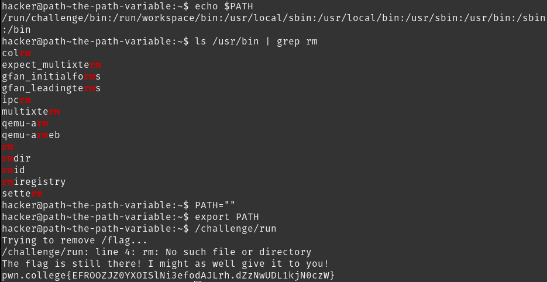

# The PATH Variable

The PATH variable stores all the directories of where all the commands are in a colon-separated format. The `rm` command lives in `/usr/bin`. Setting PATH as `` makes it so `/challenge/run` cannot find `rm`

## Solution:

