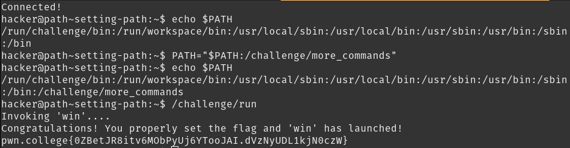

# Setting PATH

Even though unnecessary for this challenge, it is possible to append directories to PATH (as shown in the solution), so appending the directory of `/challlenge/more_commands` lets /challenge/run` work.

## Solution:

