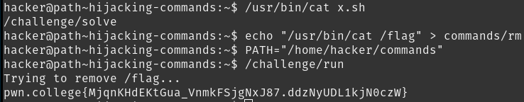

# Hijacking Commands

The `rm` command is run as `/usr/bin/rm` because of the PATH variable. Changing PATH to a certain directory that contains a modified `rm` means we can make `/challenge/run` do anything, including reading `/flag`. Since `cat` also resides in the same directoru as `rm`, we can use its absolute path, `/usr/bin/cat`.

## Solution:

