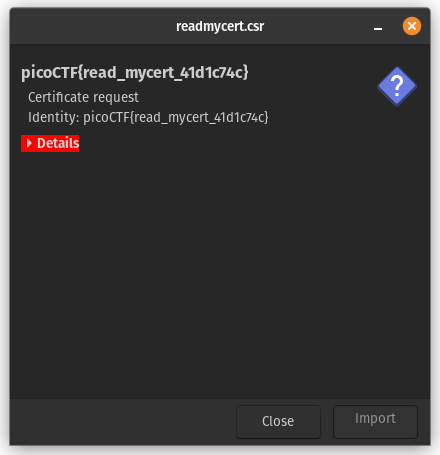

# C3

**Flag:** `picoCTF{adlibs}`

## Approach

- Download the encoder and ciphertext. The first few lines are used to take input from the user through the terminal. Next, we have 2 strings. The name suggests they are used as lookup tables, which matches the description of the challenge:
> This is the Custom Cyclical Cipher!

- Running the program gives an idea of how it works. `test` returns `nfOB` and `abababab` returns `OBtBtBtB`. The output has the same length as the input, and looking at the code we can see that each character corresponds to a character in the same position (index) of the input string.

- Let's look at the encoder again. The `for` loop moves through each character of the input. It stores the index of both the current (`cur`) and previous (`prev`) characters. This means the that any character in the output only depends on two factors, the corresponding input character index and the one before it. This is reflected in the `abababab` test input that we tried. The first charater in that test input was different to the pattern because of the line just before the for loop; `prev = 0`. This basically "assumes" the zeroeth character's lookup index to be 0.

```
prev = 0
for char in chars:
  cur = lookup1.index(char)
  out += lookup2[(cur - prev) % 40]
  prev = cur
```

- Now let's take a look at the loopup tables. They are both a "list" of 40 characters each.
```
lookup1 = "\n \"#()*+/1:=[]abcdefghijklmnopqrstuvwxyz"
lookup2 =   "ABCDEFGHIJKLMNOPQRSTabcdefghijklmnopqrst"
```

- If the previous character's index were 0 (which is always true for the first character), it would just copy the same index. This is because of a specific line in the `for` loop. In python, if the dividend in a modulo operation is negative, the result subtracted from the divisor. This means `55 % 40`, which would usually result in -15, returns 25 in python since `40 - 15 = 25`. This means we can easily reverse the operation done in this encoder.

`out += lookup2[(cur - prev) % 40]`
- This can easily be understood by modifying the encoder code a bit. The first output character has the same index as `prev = 0`. The next character is calculated using `(18 - 33) % 40 = 25`. This is continued till the last character of the input.
  - Input
    ```
    import sys
    chars = ""
    from fileinput import input
    # for line in input():
    #   chars += line
    chars = "test"
    print(repr(chars)) #
    
    lookup1 = "\n \"#()*+/1:=[]abcdefghijklmnopqrstuvwxyz"
    lookup2 =   "ABCDEFGHIJKLMNOPQRSTabcdefghijklmnopqrst"
    
    out = ""
    
    prev = 0
    for char in chars:
      cur = lookup1.index(char)
      print(f"{repr(char)}: lookup1[{cur}]", end='\t') #
      out += lookup2[(cur - prev) % 40]
      print(f"{lookup2[(cur - prev) % 40]}: lookup2[{(cur - prev) % 40}]") #
      prev = cur
    
    sys.stdout.write(out)
    print() #
    ```
  - Output
    ```
    'test'
    't': lookup1[33]        n: lookup2[33]
    'e': lookup1[18]        f: lookup2[25]
    's': lookup1[32]        O: lookup2[14]
    't': lookup1[33]        B: lookup2[1]
    nfOB
    ```
- We can now write a decoder program. Keep in mind that our input here is encoded and the output is plain text. 
  - For the first character `n`, its index in the encoded loopup table is 33. We also take `prev = 0` in this case. Now, `(0 + 33) % 40` returns 33, which is the index for `t` in the plain lookup table. Now we store 33 in `prev`.
  - For the second character `f` (index = 25), we again calculate `(33 + 25) % 40`, which returns 18, the index of `e`. Now we store 18 in `prev`.
  - This goes on till the last character of the encoded string.
```
encoded = "nfOB"
plain = ""
lookup_plain = "\n \"#()*+/1:=[]abcdefghijklmnopqrstuvwxyz"
lookup_encoded = "ABCDEFGHIJKLMNOPQRSTabcdefghijklmnopqrst"

prev = 0
for char in encoded:
    cur = lookup_encoded.index(char)
    plain += lookup_plain[(prev + cur) % 40]
    prev = (prev + cur) % 40

print(plain)
```
- As expected, the output is `test`. Now we can input the given ciphertext in our decoder and get the output, which is clearly a code written in Python 2.
```
#asciiorder
#fortychars
#selfinput
#pythontwo

chars = ""
from fileinput import input
for line in input():
    chars += line
b = 1 / 1

for i in range(len(chars)):
    if i == b * b * b:
        print chars[i] #prints
        b += 1 / 1


```
- This seems to be a piece of code which only prints the input characters whose index is a cube of a natural number (1, 8, 27...). Looking at `#selfinput`, we know that the program takes itself as its input. Doing that returns this:
```
a
d
l
i
b
s
```

- **The flag is:** `picoCTF{adlibs}`.


## New concepts

1. Working of the `fileinput.input()` function in python


## Incorrect methods tried

- In the second stage, after looking at `#selfinput`, I thought the input might be the same ciphertext. This returns `LgHDPt` (ignoring `\n`). The flag `picoCTF{LgHDPt}` was incorrect, though.

- `#selfinput` could also mean the program takes itself as its input. This gives the output `adlibs` (ignoring `\n`). I put this through the original encoder which returned `ODIrnR`. (an unnecessary extra step)


&nbsp;

&nbsp;

<hr style="border:2px solid gray; background-color: gray">
&nbsp;

&nbsp;


# Custom encryption

**Flag:** `picoCTF{custom_d2cr0pt6d_751a22dc}`

## Approach

- The code is clearly a Python module which is meant to be used for encryption. Running the program with a few test inputs shows that the output is a list of numbers as long as the input message.

- The `generator()` function has a simple output of `(g ^ x) mod p`. This has a similar look to `ciphertext = (message ^ exponent) mod (pq)` from RSA excryption.

- The `test()` function seems to have an example usage of the library. Let's analyse it.
  - The `message = sys.argv[1]` means that the message to be encrypted has to be entered as a command line argument. We can modify it temporarily: `message = "<plain text>"`.
  - It has the following inputs:
    - 2 prime numbers p (= 97) and g (= 31)
    - `plain_text`: The text message to be encrypted
    - `text_key`: The text key used to encrypt `plain_text`
  - The function generates 2 random numbers a and b, which are random numbers upto 10 less than p and q respectively.
  - Then, it calculates two values: `(((g**b) mod p)**a) mod p` and `(((g**a) mod p)**b) mod p`. If these two are same, they become the `shared_key`.
  - Now, the `plain_text` is XOR-ed with the `text_key` using `dynamic_xor_encrypt()`, which is further encrypted using the `encrypt()` function.

- The encrypted flag has the same output format as the `test()` function, with the random values `a` and `b` included. This and the included values suggest that the values of `p` and `g` also remain unchanged. Solving for `key` with these values gives **93**.

- The `dynamic_xor_encrypt()` is the step 1 of our cipher. It is a [simple XOR cipher](https://www.dcode.fr/xor-cipher) and repeats the key if it is shorter than the given message. Notably, it reverses the message. Step 2 is `encrypt()`, which does `character * shared_key * 311` for every character of its input. We already know the `shared_key` is probably 93, so let's give it a go with that.

- This is a simple program that reverses the encryption:
```
cipher = [ # As given in the challenge
    260307,
    ..., # Removed numbers in between to maintain readability
    491691
]

# Undo the work done by `encrypt()` using the known values
semi_cipher = [(i // (93 * 311)) for i in cipher]

# Undo the XOR cipher using a guessed key `trudeau`
for i in range(len(semi_cipher)-1, -1, -1):
    print(chr(semi_cipher[i] ^ ord("trudeau"[i % 7])), end='')

print()
```

- The first step just reverses the multiplication done in the `encrypt()` function. The second step reverses the XOR encryption by guessing that the same plain-text key was used. Since XOR is reversible using XOR, this is a trivial matter. We can simply XOR the characters of the encrypted message with those of the plain-text key.

- The output reveals the key along with the `picoCTF{}` wrapper: 
```
picoCTF{custom_d2cr0pt6d_751a22dc}
```

## New concepts
1. Modular arithmetic

## References
- https://ctf101.org/cryptography/what-is-rsa/
- https://www.khanacademy.org/computing/computer-science/cryptography/modarithmetic
- https://www.dcode.fr/xor-cipher


&nbsp;

&nbsp;

<hr style="border:2px solid gray; background-color: gray">
&nbsp;

&nbsp;

# miniRSA

**Flag:** `picoCTF{n33d_a_lArg3r_e_ccaa7776}`

## Approach

- The given data has a small public exponent and relatively small ciphertext. This means we can apply the cube root attack (since e = 3) to the ciphertext. This gives:
`13016382529449106065894479374027604750406953699090365388203708028670029596145277`
- Then, we can conver this number to hexadecimal:
`0x7069636f4354467b6e3333645f615f6c41726733725f655f63636161373737367d`
- This can then be separated into groups of 2 digits (1 byte each) and converted to `utf-8` to get the flag.
- All of this can just be done by the RsaCtfTool python script.
```
Decrypted data :
HEX : 0x7069636f4354467b6e3333645f615f6c41726733725f655f63636161373737367d
INT (big endian) : 13016382529449106065894479374027604750406953699090365388203708028670029596145277
INT (little endian) : 14498533606165685119718956852327439022714916090771037807901302412009841646332272
utf-8 : picoCTF{n33d_a_lArg3r_e_ccaa7776}
STR : b'picoCTF{n33d_a_lArg3r_e_ccaa7776}'
```

## References

- https://ctf101.org/cryptography/what-is-rsa/
- https://github.com/RsaCtfTool/RsaCtfTool
- https://www.dcode.fr/unicode-coding
- https://www.mathsisfun.com/calculator-precision.html

&nbsp;

&nbsp;

<hr style="border:2px solid gray; background-color: gray">
&nbsp;

&nbsp;

# rotation

**Flag:** `picoCTF{r0tat1on_d3crypt3d_949af1a1}`

## Approach

- The cipher can be identified using an identification tool such as [this](https://www.dcode.fr/cipher-identifier).
- Apply brute force decrption of the Affine cipher knowing that the flag starts with `picoCTF`
- The values for A and B are 1 and 8 respectively.

&nbsp;

&nbsp;

<hr style="border:2px solid gray; background-color: gray">
&nbsp;

&nbsp;

# ReadMyCert

**Flag:** `picoCTF{read_mycert_41d1c74c}`

## Approach

- Opening the .csr file using the certificate manager shows its name, which is the flag


## New concepts

1. CSR and CSR files

## References

- https://en.wikipedia.org/wiki/Certificate_signing_request

&nbsp;

&nbsp;

<hr style="border:2px solid gray; background-color: gray">
&nbsp;

&nbsp;

# HideToSee

**Flag:** `picoCTF{atbash_crack_7142fde9}`

## Approach

- Use a steganographic decoder on the image to get `krxlXGU{zgyzhs_xizxp_7142uwv9}`
- A cipher identification tool can deduce that it has been encoded using the Atbash cipher.
- Use [an Atbash Cipher decoder](https://www.dcode.fr/atbash-cipher) to get the flag

## Incorrect methods tried

- Going to the website mentioned in the image

&nbsp;

&nbsp;

<hr style="border:2px solid gray; background-color: gray">
&nbsp;

&nbsp;

# SRA

**Flag:** `picoCTF{7h053_51n5_4r3_n0_m0r3_dd808298}`

## Approach

- The program uses names of sins to name variables, which can be easily deciphered as RSA variables:
```
plaintext = "".join(choice(ascii_letters + digits) for _ in range(16))
p = getPrime(128)
q = getPrime(128)
n = p * q
e = 65537
d = inverse(e, (p - 1) * (q - 1))

ciphertext = pow(bytes_to_long(plaintext.encode()), e, n)

print(f"{ciphertext = }")
print(f"{d = }")

print("input_text?")
input_text = input("> ").strip()

if input_text == plaintext:
    print("Conquered!")
    with open("/challenge/flag.txt") as f:
        print(f.read())
else:
    print("Hubris!")
```

- The program outputs the ciphertext and the private exponent, but not the modulus. Since `(d*e) ≡ 1 (mod n)` ⇒ `(d*e) - 1 ≡ 0 (mod n)` ⇒ `(d*e) - 1 = k * n`, where `k` is any whole number. Using this, the following program finds n through bruteforce and outputs the alphanumeral plaintext:
```
import Crypto.Util.number as cry
import sympy
import math

ciphertext = ... # Input
d = ... # Input

e = 65537 # known

div = sympy.divisors(e*d - 1)
primes = [x+1 for x in div if (int(math.log2(x+1)) == 127)] # print(math.log2(cry.getPrime(128)))


for p in primes:
    for q in primes:
        n = p * q
        try:
            plaintext = pow(ciphertext, d, n).to_bytes(16).decode()
        except OverflowError:
            continue
        print(f"{">>>" if plaintext.isalnum() else ""}{plaintext}")

```

## New concepts

1. More concepts in Modular Arithmetic

## Incorrect methods tried

- Finding `n` for all values of `p` and `q` without filtering

## References

- https://github.com/RsaCtfTool/RsaCtfTool
- https://ctf101.org/cryptography/what-is-rsa/


&nbsp;

&nbsp;

<hr style="border:2px solid gray; background-color: gray">
&nbsp;

&nbsp;

# rsa-oracle

**Flag:** `picoCTF{su((3ss_(r@ck1ng_r3@_881d93b6}`

## Approach

- Since it is easy to encrypt/decrypt any number using the oracle, it is easy to use a CPA (Chosen Plainetext Attack)
- Encrypting `2` with the oracle returns 
```
4707619883686427763240856106433203231481313994680729548861877810439954027216515481620077982254465432294427487895036699854948548980054737181231034760249505
```
- Multiplying with the password:
```
8309123510912461959808862575577506568980638191919068913508647821620764640014326902659577232892646106320049174456027132117561974697506072947542595801124414707062811856434694174516846811411223916199405518690220657132395429747802747678528921583821953733155445656601842923912509578170177053137398927381505510500
```
- Decrypting with the oracle: `0xafaf9a59322` = `12073046479650`
- Divide by ASCII value of '2', i.e. `50`: `0x3838316439`
- Decode as ASCII values: `0b'\x38\x38\x31\x64\x39'` = `881d9`
- Decrypt password using `openssl` (the password is identified as `openssl enc'd data with salted password ` using `file`)
```
$ openssl aes-256-cbc -d -in secret.enc
enter AES-256-CBC decryption password:
*** WARNING : deprecated key derivation used.
Using -iter or -pbkdf2 would be better.
picoCTF{su((3ss_(r@ck1ng_r3@_881d93b6}
```

## New concepts

1. CPA

## References

- https://www.geeksforgeeks.org/modular-arithmetic/
- https://crypto.stackexchange.com/questions/2323/how-does-a-chosen-plaintext-attack-on-rsa-work
- https://stackoverflow.com/questions/16056135/how-to-use-openssl-to-encrypt-decrypt-files
- https://www.cs.cmu.edu/~pattis/15-1XX/common/handouts/ascii.html

&nbsp;

&nbsp;

<hr style="border:2px solid gray; background-color: gray">
&nbsp;

&nbsp;

# Mind your Ps and Qs

**Flag:** `picoCTF{sma11_N_n0_g0od_73918962}`

## Approach

- Use the RsaCtfTool:
```
$ python RsaCtfTool.py -n 1584586296183412107468474423529992275940096154074798537916936609523894209759157543 -e 65537 --decrypt 964354128913912393938480857590969826308054462950561875638492039363373779803642185
private argument is not set, the private key will not be displayed, even if recovered.
['/tmp/tmp1q7am4i8']

[*] Testing key /tmp/tmp1q7am4i8.
attack initialized...
attack initialized...
[*] Performing lucas_gcd attack on /tmp/tmp1q7am4i8.
100%|████████████████████████████████████████████████| 9999/9999 [00:00<00:00, 430999.59it/s]
[+] Time elapsed: 0.0285 sec.
[*] Performing factordb attack on /tmp/tmp1q7am4i8.
[*] Attack success with factordb method !
[+] Total time elapsed min,max,avg: 0.0285/0.0285/0.0285 sec.

Results for /tmp/tmp1q7am4i8:

Decrypted data :
HEX : 0x007069636f4354467b736d6131315f4e5f6e305f67306f645f37333931383936327d
INT (big endian) : 13016382529449106065927291425342535437996222135352905256639684640304028661985917
INT (little endian) : 3711160986047915108755079562074128500208424285494215969975035182007076726805983232
utf-8 : picoCTF{sma11_N_n0_g0od_73918962}
utf-16 : 瀀捩䍯䙔獻慭ㄱ也湟弰で摯㝟㤳㠱㘹紲
STR : b'\x00picoCTF{sma11_N_n0_g0od_73918962}'
```

&nbsp;

&nbsp;

<hr style="border:2px solid gray; background-color: gray">
&nbsp;

&nbsp;

# Play Nice

**Flag:** `f391b621282ef5063ab2de93ab9e4bff`

## Approach

- The challenge program encrypts the characters of the flag pairwise with a pre-determined key.
- The ciphertext can be decoded by any [Playfair Cipher Decoding tool](https://www.dcode.fr/playfair-cipher), making sure to adjust the settings according to the defined functions.


- Copy the plaintext into the program to get the flag.

## New concepts

1. Playfair cipher

## References

- https://www.dcode.fr/playfair-cipher

&nbsp;

&nbsp;

<hr style="border:2px solid gray; background-color: gray">
&nbsp;

&nbsp;

# b00tl3gRSA2

**Flag:** `picoCTF{bad_1d3a5_4783252}`

## Approach

- The challenge states that the encryption is done with a large and small d. This means it is susceptible to Wiener's attack for small private exponent
- Using the RsaCtfTool, crack the given cipher for Weiner's attack:
```
$ python 'RsaCtfTool.py' --output 'out.txt' \
-n 103611701291979267908460620567054039903205794973215099895885434097295170995795192919919361998529155301506155154631322291880829946408979960389478913598274450633241613064118157154938221735388550306233782421984690493295721603923466786143319344261789033366083606324714599350541178246258363632534189264237044085899 \
-e 96977972274460232735292780051019452548980677624120534090872460029634909807483908767578216646349038182243451231216563783912324179359342657586569816119623294026899553244238914236963761343629833075559739576714565922200661691210987040654314029683834668253381030207153962671214698577827071577874636084905749282321 \
--decrypt 52140886119754190146597389199820890224910698214194285735445455499749173952778579688083673147972142352827169709518895591294019252529179176588188671722435306966943153650629574020297988535702479727870359599701522357789163904447048876718389591474454680994068810560598395293051534631819293467808186151799836548987 \
--attack wiener
private argument is not set, the private key will not be displayed, even if recovered.
['/tmp/tmplcnrakca']

[*] Testing key /tmp/tmplcnrakca.
[*] Performing wiener attack on /tmp/tmplcnrakca.
  5%|██▎                                                 | 14/311 [00:00<00:00, 28136.20it/s]
[*] Attack success with wiener method !

Results for /tmp/tmplcnrakca:

Decrypted data :
HEX : 0x0000000000000000000000000000000000000000000000000000000000000000000000000000000000000000000000000000000000000000000000000000000000000000000000000000000000000000000000000000000000000000000000000000000000007069636f4354467b6261645f31643361355f343738333235327d
INT (big endian) : 180638594769037903267909311328535969949661653466129492033745533
INT (little endian) : 87915708203145282610294972968911366155903715376253613591493747328997039762324724152737381588249902516221925909575347268323406342359083908236607141716518709062203918941441530400517793579352373597960230114723867721326316384129937388432851450794910176330916868853347433852177960598981938565164199179134034771968
utf-8 : picoCTF{bad_1d3a5_4783252}
utf-16 : 楰潣呃筆慢彤搱愳張㜴㌸㔲紲
STR : b'\x00\x00\x00\x00\x00\x00\x00\x00\x00\x00\x00\x00\x00\x00\x00\x00\x00\x00\x00\x00\x00\x00\x00\x00\x00\x00\x00\x00\x00\x00\x00\x00\x00\x00\x00\x00\x00\x00\x00\x00\x00\x00\x00\x00\x00\x00\x00\x00\x00\x00\x00\x00\x00\x00\x00\x00\x00\x00\x00\x00\x00\x00\x00\x00\x00\x00\x00\x00\x00\x00\x00\x00\x00\x00\x00\x00\x00\x00\x00\x00\x00\x00\x00\x00\x00\x00\x00\x00\x00\x00\x00\x00\x00\x00\x00\x00\x00\x00\x00\x00\x00\x00picoCTF{bad_1d3a5_4783252}'
```

## References

- https://github.com/RsaCtfTool/RsaCtfTool
- https://ctf101.org/cryptography/what-is-rsa/

&nbsp;

&nbsp;

<hr style="border:2px solid gray; background-color: gray">
&nbsp;

&nbsp;

# b00tl3gRSA3

**Flag:** `picoCTF{too_many_fact0rs_4025135}`

## Approach

- The challenge states that the encryption is using many primes for n. This means n is much easier to factorise. Since RsaCtfTool does not support multi-prime moduli and sympy takes too long to factorise n, make use of [this tool](https://www.alpertron.com.ar/ECM.HTM) which returns the totient directly.
- The following Python code uses the totient to get the flag:
```
n = 33093700808486240341458109416592994184150074848043993159249554901314666885731441051615884643599472094678057173943408764876452218722684400541722190004891985759726254219187375425337501771382232651743254791468919326601237882000489873955275268407566605613040221337608020185651328652208179357674112554187420228864931807057137388800587704091272227611
c = 32262502512124397841210341275952172635461371366804247277562508019904927325573582041031932769248552961106919648108565278567342019711618949689101836096176498302492689546764850181320987059121472450310504499695328239494462888222425025525364244025256544641978846361991464242047180022132100835186871564443692451222459931450936323077480541128747037517
e = 65537

phi_n = int("33 093700 718005 622876 542509 700611 902762 083314 852436 460952 599080 032660 832342 374171 221893 463919 732966 795330 154138 536244 225885 437045 085412 133726 464285 047169 957338 646127 096930 048929 161386 674243 661791 959813 267171 190437 624841 962818 145507 489807 561148 347667 808027 963103 910871 747812 478099 753823 073047 239606 832670 564859 525169 341583 211888 640000 000000 000000".replace(' ', ''))
d = pow(e, -1, phi_n)
m = pow(c, d, n)

print(m.to_bytes(33))
```

## References

- https://ctf101.org/cryptography/what-is-rsa/
- https://www.alpertron.com.ar/ECM.HTM
- https://stackoverflow.com/questions/4798654/modular-multiplicative-inverse-function-in-python
- https://gist.github.com/jackz314/09cf253d3451f169c2dbb6bbfed73782

&nbsp;

&nbsp;

<hr style="border:2px solid gray; background-color: gray">
&nbsp;

&nbsp;

# XtraORdinary

**Flag:** `picoCTF{w41t_s0_1_d1dnt_1nv3nt_x0r???}`

## Approach

- The challenge encrypts the flag by XOR-ing with a random "secret", then with a list of random strings. Since XOR is its own inverse, any XOR more than once can be reduced to modulo 2, i.e. XOR-text or plaintext.
- Try out each combination of the random strings. This returns a list of random bytes. Then, XOR each of these byte strings with `picoCTF{` to get the key.
```
with open("output.txt", 'r') as f:
    ciphertext = bytes.fromhex(f.read())

def binpad(i: int, length: int):
    i = bin(i)[2:]
    i = '0' * (length - len(i)) + i
    return i

def decrypt(ptxt, key) -> bytes:
    etxt = b''
    for i in range(len(ptxt)):
        a = ptxt[i]
        b = key[i % len(key)]
        etxt += bytes([a ^ b])
    return etxt

random_strs = [
    b'my encryption method',
    b'is absolutely impenetrable',
    b'and you will never',
    b'ever',
    b'break it'
]

step1_possible = []
def reverse_random():
    global ciphertext
    global random_strs
    global step1_possible
    print("Step 1:")
    for i in range(2**len(random_strs)):
        step1_possible.append(ciphertext)
        i_bin = binpad(i, len(random_strs))
        for j in range(len(i_bin)):
            if int(i_bin[j]):
                step1_possible[i] = decrypt(step1_possible[i], random_strs[j])
        print(f"    {binpad(i, len(random_strs))}: {step1_possible[i]}")

reverse_random()

keys = []
flag = b"picoCTF{"

print("Step 2:")
for i in range(len(step1_possible)):
    keys.append(decrypt(flag, step1_possible[i]))
    print(f"    {binpad(i, len(random_strs))}: {keys[-1]}")
```
```
00111: b'Africa!A'
```
- The last 3 of the random strings have been used to encrypt the flag, presumably using the key `Africa!`
- Now, decrypt the flag using this information.
```
with open("output.txt", 'r') as f:
    ciphertext = bytes.fromhex(f.read())

def decrypt(ptxt, key) -> bytes:
    etxt = b''
    for i in range(len(ptxt)):
        a = ptxt[i]
        b = key[i % len(key)]
        etxt += bytes([a ^ b])
    return etxt

random_strs = [
    b'my encryption method',
    b'is absolutely impenetrable',
    b'and you will never',
    b'ever',
    b'break it'
]

for i in random_strs[2:5]:
    ciphertext = decrypt(ciphertext, i)

key = "Africa!"

print(decrypt(ciphertext, key.encode()).decode())
```

&nbsp;

&nbsp;

<hr style="border:2px solid gray; background-color: gray">
&nbsp;

&nbsp;

# Compress and Attack

**Flag:** `picoCTF{sheriff_you_solved_the_crime}`

## Approach

- The Salsa20 cipher used in the challenge code does not seem to have any way to feasably decrypt it, so the weakest link in this case is the `zlib` library. The code outputs the length of the enrypted text in each iteration, and appending bits of the flag (greater than 3 characters) means zlib compresses the string down. 
- Since the start of the flag (`picoCTF{`) is known, it is possible to iterate through printable characters to figure out the flag.
```
import string

POSSIBLE_CHARS = string.printable


def get_len(remote, payload: str) -> int:
    print(f"PL: {payload}")
    sh.sendline(payload)
    compressed_length = int(sh.recvlines(3)[2].decode())
    return compressed_length

def getFlag(remote, known_flag: str) -> str:
    # len(known_flag) > 2
    global POSSIBLE_CHARS
    flag = known_flag
    COMPRESSED_SIZE = get_len(remote, flag)
    # print(f"Flag status: {flag}")
    while flag[-1] != '}':
        # Loops until the flag is closed
        for next_chr in POSSIBLE_CHARS:
            # Checks each printable character for the next possible
            # character of the flag
            if (get_len(remote, flag + next_chr) == COMPRESSED_SIZE):
                flag += next_chr
                # print(next_chr)
                break
        else:
            raise SyntaxError(f"Unexpected character at {len(flag) + 1}")
    return flag

if __name__ == '__main__':
    import pwn
    sh = pwn.remote("mercury.picoctf.net", 2431)
    # Since the remote can stop responding at times, update this string with the progress
    print(getFlag(sh, "picoCTF{"))

```

## New concepts

1. zlib and GNU compression
2. Salsa20 and Chacha20 ciphers
3. AES encryption

## Incorrect methods tried

- Trying to crack the Salsa20 encryption

&nbsp;

&nbsp;

<hr style="border:2px solid gray; background-color: gray">
&nbsp;

&nbsp;

# college-rowing-team

**Flag:** `picoCTF{1_gu3ss_p30pl3_p4d_m3ss4g3s_f0r_4_r34s0n}`

## Approach

- The challenge provides a list of RSA-encrypted ciphertexts with the corresponding modulus and public exponent. The cipher's code reveals that the list contains, randomly, 3 encouraging messages and the flag; which are also jumbled.
- The public exponent is too small and the message is not padded in any way. This means that the cipher is vulnerable to attacks. The optimised code for this attack is given [here](https://book.jorianwoltjer.com/cryptography/asymmetric-encryption/rsa#small-exponent-short-plaintext-root). It leverages the fact that m<sup>3</sup> (m is the message as a number) is smaller than or comparable to n (n is the modulus). Here is the mathematical explanation:

```
c = m^3 mod n
m^3 = c + n × k
m = ∛(c + n × k)
```

- Here, k is a small number, so iterating through whole numbers should be enough to get the plaintext flag. Here is the code, leveraging the code found on "Practical CTF":

`small_e_crack.py:`
```
# Credit: https://book.jorianwoltjer.com/cryptography/asymmetric-encryption/rsa

from gmpy2 import iroot
from Crypto.Util.number import long_to_bytes
import itertools
from tqdm import tqdm  # Progress bar

def crack(c: int, n: int, e: int) -> bytes:
    for k in tqdm(itertools.count()):
        c_before_mod = c + n*k

        if iroot(c_before_mod, e)[1]:  # If perfect root
            break

    plaintext = long_to_bytes(iroot(c_before_mod, e)[0])
    return plaintext
```
`decode.py:`
```
import small_e_crack


N = 0
E = 1
C = 2

with open("encrypted-messages.txt", 'r') as f:
    file = f.read().strip().split()

ciphertexts_list = []
for i in range(0, len(file), 6):
    ciphertexts_list.append((int(file[i + 1]), int(file[i + 3]), int(file[i + 5])))

for ct in ciphertexts_list:
    plaintext = small_e_crack.crack(ct[C], ct[N], ct[E]).decode()
    if "picoCTF{" in plaintext:
        print(f"FOUND FLAG: {plaintext}")
        exit(0)
```
output:
```
0it [00:00, ?it/s]
0it [00:00, ?it/s]
FOUND FLAG: picoCTF{1_gu3ss_p30pl3_p4d_m3ss4g3s_f0r_4_r34s0n}
```

- Using message padding would have made `m^3` much larger than n, making k too large to feasabily crack this cipher.

## New concepts

1. Hastad's attack
2. Message padding in RSA

## Incorrect methods tried

- Using RsaCtfTool individually for each ciphertext

## References

- https://book.jorianwoltjer.com/cryptography/asymmetric-encryption/rsa
- https://github.com/RsaCtfTool/RsaCtfTool

&nbsp;

&nbsp;

<hr style="border:2px solid gray; background-color: gray">
&nbsp;

&nbsp;

