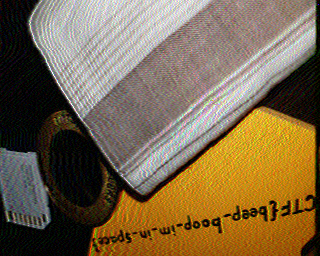

# Trivial Flag Transfer Protocol

**Flag:** `picoCTF{h1dd3n_1n_pLa1n_51GHT_18375919}`

## Approach

- Open the `.pcapng` file in Wireshark
- There seem to be some files that can be extracted (File > Export objects)
- There are two excrypted messages. They can be decoded with ROT13 ([Cipher Identfier](https://www.dcode.fr/cipher-identifier))
- There is a steganography program included, and there are 3 images
- Use the password `DUEDILIGENCE` to decode the 3 images. The third image reveals the flag.

## New concepts

1. `.pcap` files
2. Reading `.pcap` files with Wireshark

## Incorrect methods tried

- Decrypting plaintext with other ciphers
- Decoding hidden messages in images without any password

## References

- https://futureboy.us/stegano/decinput.html

&nbsp;

&nbsp;

&nbsp;

&nbsp;

# m00nwalk

**Flag:** `picoCTF{beep_boop_im_in_space}`

## Approach

- The challenge name suggests that the given `.wav` file has something to do with the moon. This suggests looking into SSTV transmission.
- Analyze and decode the given audio file with QSSTV to get the following image:

## New concepts

1. SSTV transmission

## Incorrect methods tried

- Spectral analysis of the audio file

## References

- https://www.scopeofwork.net/how-slow-scan-tv-shaped-the-moon/
- https://monliclican.medium.com/the-transmission-from-creation-to-solution-walkthrough-61457e7dc65f

&nbsp;

&nbsp;

&nbsp;

&nbsp;

# tunn3l v1s10n

**Flag:** `picoCTF{qu1t3_a_v13w_2020}`

## Approach

- The given image has the magic bytes of a Windows Bitmap file: `42 4D 8E 26`
- The wikipedia entry for Bitmap files says that 14 bytes are reserved for the header and 40 bytes (assuming the widely-used Bitmap v1 standard) for the image information a.k.a the DIB Header.
- Chaning bytes 15 and 16 to `28 00` respectively makes the file open-able in image viewers. (Though previously open-able in XNviewMP)

- The bytes 10-13 store the offset at which the image starts. Chaning these to `38 00 00 00` (just after the header ends) adds the previously ignored data
- Changin the value of the height of the image (stored at byes 22-25) to 3 times its original value (from `32 01 00 00` = 306 to `96 03 00 00` = 918) makes the flag visible in the image

## New concepts

1. Header sizes
2. Bitmap DIB headers
3. Information stored in file headers
4. TrID file identification

## Incorrect methods tried

- Trying to read as/convert to `.bs` file
- Incorrect heights (`FF FF 00 00` or 2 times the original)
- Comparision of hex dump with a Bitmap v5 file

## References

### `.BS` files
- http://fileformats.archiveteam.org/wiki/Printfox_bitmap
- https://www.digipres.org/formats/sources/wikidata/formats/#q105859090
### Bitmap file header
- Hex editing and file identification: https://hexed.it/
- File signature identification: https://en.wikipedia.org/wiki/List_of_file_signatures
- Bitmap header: https://en.wikipedia.org/wiki/BMP_file_format#Bitmap_file_header
- DIB header size: https://surferhelp.goldensoftware.com/subsys/subsys_bitmap_file_description.htm
- Bitmap DIB header: https://learn.microsoft.com/en-us/previous-versions/dd183376(v=vs.85)

&nbsp;

&nbsp;

&nbsp;

&nbsp;

