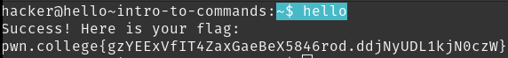

# Intro to Commands

The command `whoami` prints the username to the terminal. `pwn.college` has implemented their own `hello` command, which upon execution reveals the flag.

## Solution:
`$ hello`

