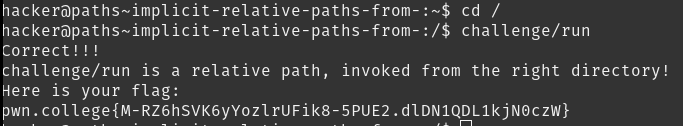

# Implicit Relative Paths

Not including `/` in the start of a path effectively prepends the path of the current working directory. cd-ing to `/` and running `challenge/run` gives the flag

## Solution:

