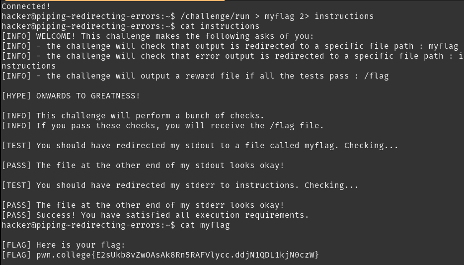

# Redirecting Errors

Whichever channel is redirected does not get printed on the terminal. The program also knows which channel has been redirected into what file. Based on this it can make decisions (such as whether to print the flag to `myflag`). So what would happen if we redirect stdin?

## Solution:

