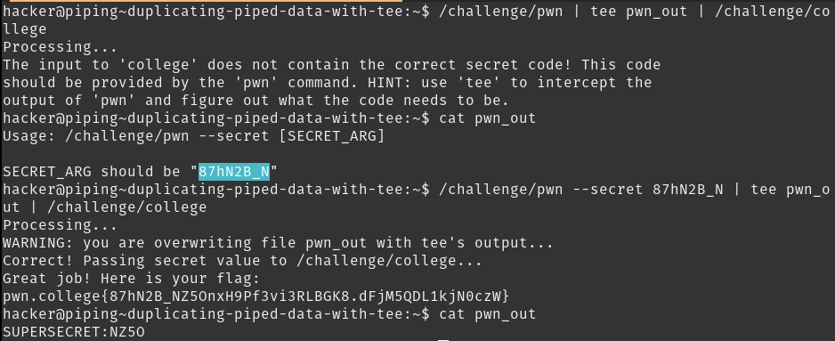

# Duplicating piped data with `tee`

The `tee` command passes the piped text to its attributes, which can further be piped to other programs. `/challenge/pwn | tee pwn_out | /challenge/college` reveals the secret argument that needs to be passed to `/challenge/pwn`.
Running the command again with the secret attribute, and keeping `pwn_out` in the command for curiosity reveals the flag, but `cat pwn_out` reveals `SUPERSECRET:NZ5O`. This "Supersecret" does not any immediately apparent uses, but what if there are more "Supersecrets" in other challenges?

## Solution:

