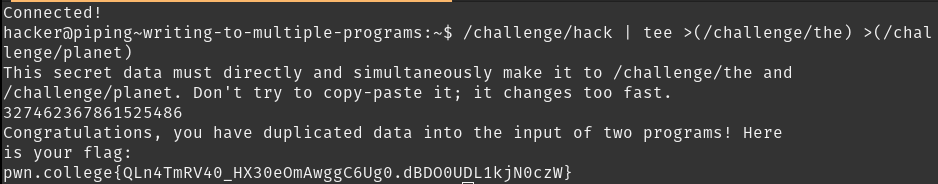

# Writing to Multiple Programs

This is basically like passing arguments to a function. A copy of the data is passed to the function, which then works with the data.
The intended solution of this challenge is `challenge/hack | tee >(/challenge/the) >(/challenge/planet)`, which prints the data and gives the flag.
Even though the program warns us not to try and copy-paste the data, a similar approach that does not make use of Process Substitution (instead opting to do it "manually") also works: 
- `/challenge/hack | tee /tmp/test && /challenge/the < /tmp/test && /challenge/planet < /tmp/test`
- `/challenge/hack | cat > /tmp/test && /challenge/the < /tmp/test && /challenge/planet < /tmp/test`

## Solution:

