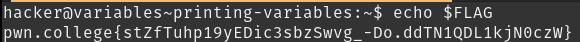
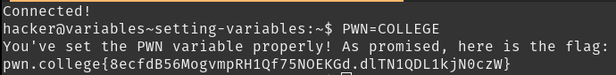
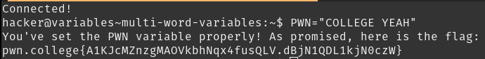

# Printing Variables, Setting Variables, Multi-word Variables

Shell varibles are used in bash scripts all the time.
`NAME=VALUE` or `NAME="Val UE"` assigns values to the variable.
`$NAME` or `"$NAME"` returns the value of the variable using "variable expansion".

Somehow the challenge is able to detect that the value of the `PWN` variable has been set correctly as soon as it is assigned a value.

## Solution:

1. 
1. 
1. 
